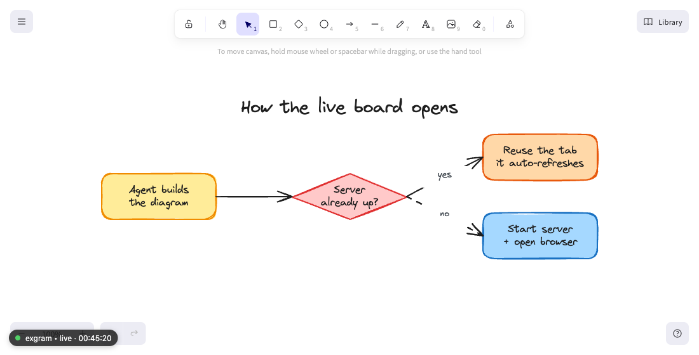

# exgram

**Prompt (or image) → live Excalidraw diagram.** A lightweight agent skill that turns a sentence,
or a screenshot of a diagram, into a real Excalidraw board and shows it on a local page that
**refreshes itself as you iterate**. Built for AI coding agents (Claude Code, Cursor, Codex, …),
it runs on whatever agent is hosting it, so there's **no API key and no per-token cost**.

> Say _"draw the checkout architecture"_ (or drop in a whiteboard photo) and a colored,
> auto-laid-out diagram appears in your browser. Ask for changes and it updates in place. Export to
> `.excalidraw` / PNG / SVG when done. Several diagrams can be live at once, each in its own tab.


<sub>↑ This diagram was generated by exgram itself, from a one-line prompt, on the live board.</sub>

---

## Why

- **Always one sentence away.** No editor plugin, no separate web app, no account.
- **From a prompt or an image.** Describe it, or hand the agent a screenshot or whiteboard photo and
  it re-creates a clean, editable version.
- **Live board, not a static file.** A real Excalidraw canvas you can hand-edit and export.
- **Many boards at once.** Each diagram gets its own slug and tab; the home page lists them all.
- **Consistent house style.** Color-by-role palette + legend + automatic layout, every time.
- **Full coverage.** Boxes-and-arrows with auto-layout for the common cases, plus a raw-elements
  escape hatch for sequence diagrams, mind maps, and pixel-precise layouts.
- **Zero install footprint.** The engine and server use only Node ≥18 built-ins; the viewer loads
  Excalidraw from a CDN. No Python, no Playwright, no `node_modules`.

## Install & use at a glance


<sub>↑ Also drawn by exgram.</sub>

## Install

As an agent skill:

```bash
npx skills add mamadoudicko/exgram          # into the current project
npx skills add mamadoudicko/exgram -g        # globally, for every project
npx skills add mamadoudicko/exgram --agent cursor   # target a specific agent
```

Requires **Node ≥ 18** on your machine and internet access the first time (the viewer pulls
Excalidraw from a CDN).

## Use

Just ask your agent for a diagram:

> "Diagram our auth flow."
> "Draw the orders database schema."
> "Show the payment service architecture with the event bus."

The skill draws a first version, opens `http://localhost:3737/?d=<slug>`, and then offers specific
refinements (colors, level of detail, icons, layout, labels). Keep iterating, every change
re-renders the live board in place, keeping your zoom and pan. Each diagram has its own slug, so you
can keep several live at once; the bare `http://localhost:3737` lists them.

You can also **hand the agent an image** (a screenshot or whiteboard photo) and it rebuilds it as an
editable diagram, then refines by chatting. To revisit a diagram later, just refer to it and the
agent edits its saved spec.

When you're happy, use Excalidraw's canvas menu to export (`.excalidraw`, PNG, or SVG).

> **The spec is the source of truth.** Each change rebuilds the whole scene, so manual edits you
> make directly on the canvas are for quick exploration and don't survive the next rebuild. To keep
> a tweak, ask the agent to fold it into the diagram (or export the board). Your zoom and pan are
> always preserved.

## How it works

```
prompt or image ─▶ agent writes workspace/<slug>.json ─▶ lib/build.mjs ─▶ workspace/<slug>.excalidraw
                                                                                    │
                       viewer.html  /?d=<slug>  (polls every 0.5s) ◀── lib/serve.mjs (:3737)
                       └── updateScene() in place, keeps zoom/pan
```

- **`lib/build.mjs`** converts a small spec (`nodes`, `edges`, `groups`, `title`, `legend`,
  optional `rawElements`) into a valid Excalidraw scene: layered auto-layout, palette colors,
  container-bound labels, bound arrows, legend, stable element ids/seeds, and a monotonic `version`
  bump so the live viewer always applies the latest.
- **`lib/serve.mjs`** is a tiny `http` server (no deps, loopback only) that serves the viewer,
  lists boards at `/api/diagrams`, and serves each scene at `/scene/<slug>.excalidraw` (slug-guarded
  against path traversal), all `no-store`.
- **`viewer.html`** loads `@excalidraw/excalidraw` (ESM, React 18) from a CDN. With `?d=<slug>` it
  renders that board and updates in place; with no slug it lists every live board.

The agent starts the board for you. It only opens a tab the first time; after that it reuses the
running server and the open tab refreshes on its own.



<sub>↑ Also drawn by exgram.</sub>

## Spec format

See [`SKILL.md`](./SKILL.md) for the full spec and the per-type guides in
[`references/`](./references). The short version:

```json
{
  "title": "Checkout flow",
  "legend": true,
  "nodes": [
    { "id": "web", "label": "Web app", "role": "frontend" },
    { "id": "api", "label": "API", "role": "backend" },
    { "id": "db", "label": "Postgres", "role": "datastore" }
  ],
  "edges": [
    { "from": "web", "to": "api", "label": "POST /checkout" },
    { "from": "api", "to": "db", "dashed": true }
  ]
}
```

Roles map to a consistent palette (frontend = blue, backend = yellow, datastore = green,
external = gray, queue = purple, service = orange, decision = red). See
[`styles/palette.md`](./styles/palette.md).

## Try it without an agent

```bash
git clone https://github.com/mamadoudicko/exgram && cd exgram
# write a spec for a diagram named "hello"
cat > workspace/hello.json <<'JSON'
{ "title": "Hello", "legend": true,
  "nodes": [{ "id": "a", "label": "Client", "role": "frontend" },
            { "id": "b", "label": "Server", "role": "backend" }],
  "edges": [{ "from": "a", "to": "b", "label": "request" }] }
JSON
node lib/build.mjs workspace/hello.json workspace/hello.excalidraw
node lib/serve.mjs &                          # serves http://localhost:3737
node lib/open.mjs "http://localhost:3737/?d=hello"
```

## Development

```bash
npm test        # node --test (no dependencies)
```

## Roadmap

- **Icons**: official AWS/GCP/Azure + simple-icons/devicon embedded as image elements.
- **Stronger layout** (crossing reduction + edge routing) for dense graphs.
- **Edit foreign diagrams**: import and restructure a hand-made `.excalidraw` file.
- More reference types (network, UML/ER notation, radial mind-map layout).
- Optional offline mode (vendor Excalidraw instead of CDN).

## License

[MIT](./LICENSE) © 2026 Mamadou Dicko. Excalidraw is a trademark of its respective owners;
this project uses the open-source `@excalidraw/excalidraw` package and is not affiliated.
