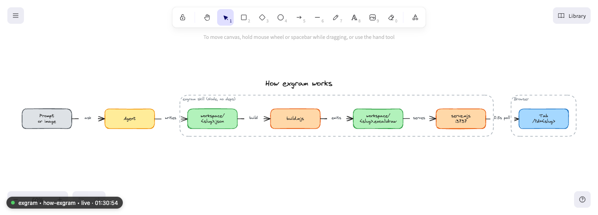
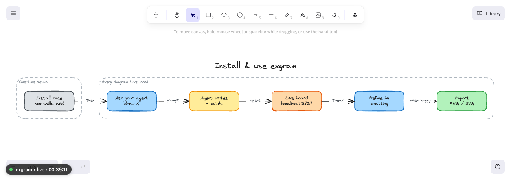

<div align="center">

<picture>
  <source media="(prefers-color-scheme: dark)" srcset="./skills/exgram/assets/wordmark-dark.svg" />
  
</picture>

### Your agent's diagrams, live and editable.

</div>

**Prompt (or image) → live Excalidraw diagram.** Describe a diagram, or drop in a screenshot, and a
clean, auto-laid-out Excalidraw board appears in your browser. Ask for changes and it updates live.
It's a Claude Code skill, so it runs on your agent with **no API key**.

<sub>The wordmark above was drawn by exgram itself — see [`skills/exgram/assets/wordmark.exgram.json`](./skills/exgram/assets/wordmark.exgram.json).</sub>



<sub>↑ This was drawn by exgram itself, from a one-line prompt.</sub>

## Install

```bash
npx skills add mamadoudicko/exgram --agent claude-code   # Claude Code
npx skills add mamadoudicko/exgram -g                     # globally, for every project
npx skills update exgram                                 # get the latest version later
```

Needs **Node ≥ 18**, and internet on first load (the board pulls Excalidraw from a CDN).

## How to use

Just ask:

> "Diagram our auth flow."
> "Draw the orders database schema."
> "Here are my rough project notes, turn them into a diagram." _(paste the notes)_
> "Turn this screenshot into an editable diagram." _(attach an image)_

exgram draws a first version, opens a live board in your browser, and offers tweaks (colors, level of
detail, layout). Keep chatting, every change re-renders **in place**, keeping your zoom and pan. When
you're happy, export to `.excalidraw` / PNG / SVG. Several boards can be live at once; the home page
lists them all.



Your boards are saved in `~/.exgram/workspace` (set `EXGRAM_WORKSPACE` to change it). They live
outside the skill folder on purpose, so running `npx skills update exgram` never deletes them.

## What it's good for

- **Raw notes → clean diagram** — dump your messy project notes and exgram structures them into a tidy, labeled board.
- **Architecture & infra** — services, queues, data stores, color-coded by role.
- **Flowcharts & state machines** — steps, decisions, swimlanes.
- **Database / ER schemas** — tables, keys, relationships.
- **Sequence diagrams & mind maps** — for anything boxes-and-arrows can't place.
- **Whiteboard photo → editable** — snap a sketch, get a clean version you can keep editing.

## Why exgram

- **One sentence away.** No editor plugin, no separate web app, no account.
- **A real board, not an image.** Hand-edit and export a live Excalidraw canvas.
- **No API key.** Runs on your agent, no per-token cost.
- **Zero install footprint.** Pure Node, no `node_modules`, no build step.

---

Spec format and internals are in [`SKILL.md`](./skills/exgram/SKILL.md); contributing in [`CONTRIBUTING.md`](./CONTRIBUTING.md).

## License

[MIT](./LICENSE) © 2026 Mamadou Dicko. Uses the open-source `@excalidraw/excalidraw` package; not
affiliated with Excalidraw.
